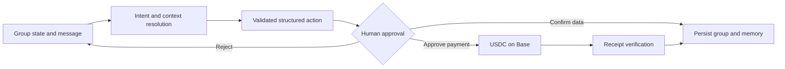
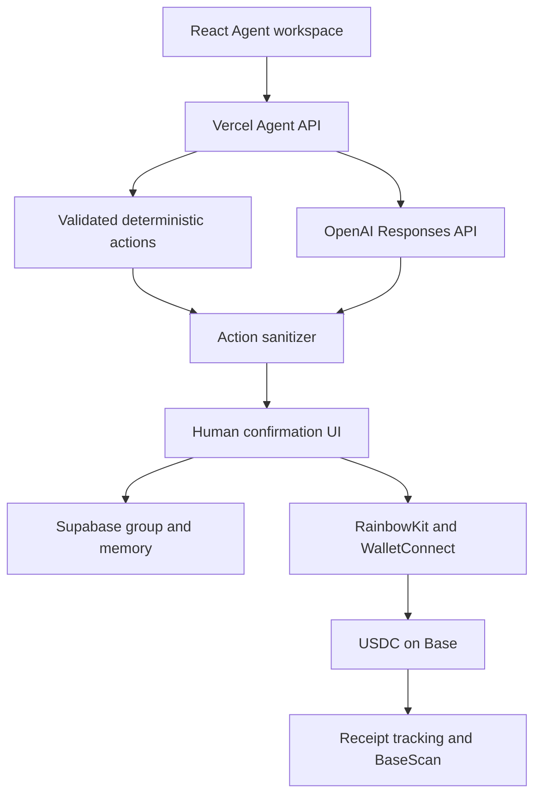

# Splitmate

Splitmate is an AI shared-money Agent for friends, roommates, trips, teams, events, and communities. It turns natural-language expense updates into validated actions, maintains the group’s financial context, calculates the smallest settlement plan, and coordinates wallet-approved USDC payments on Base.

[Live product](https://splitmate-weld.vercel.app) · [Working Agent demo](https://splitmate-weld.vercel.app/group/demo) · [Agent proof](https://splitmate-weld.vercel.app/proof) · [Orion Agents Hackathon](https://orionagents.org/hackathon)

## Why this is an Agent

Splitmate does not stop at producing chat text. It operates on a real group state and prepares structured actions that the application can validate and execute.

| Agent capability | What it does |
| --- | --- |
| Observe | Reads members, expenses, balances, selected user identity, settlement history, and conversation memory |
| Reason | Resolves natural language, asks for missing facts, explains balances, and chooses the next useful action |
| Act | Prepares expense additions, edits, deletions, member changes, analysis, and settlement plans |
| Verify | Validates every action, requires human confirmation, matches the payer wallet, and waits for a Base receipt |

## Agent execution loop



The Agent cannot silently change group data or move money. Adds, edits, deletions, and new members are reviewable proposals. Payments require the exact saved payer wallet and count only after an onchain confirmation.

## What works today

- Natural-language expense capture with multi-turn clarification
- Default equal split across the full group
- Explicit split groups that include the payer and named participants only
- Multiple expenses in one instruction
- Corrections to unconfirmed drafts
- Expense editing and deletion
- Member additions
- Balance explanations and spending analysis
- Minimal settlement-route calculation
- Persistent groups and Agent conversations
- Optional wallets during onboarding and required wallets before settlement
- WalletConnect phone handoff for the actual payer
- Native USDC transfer on Base mainnet
- Receipt tracking and BaseScan history
- Input validation, action sanitization, and model-call rate limiting

## Production evaluation

The repository includes a black-box evaluation that calls the deployed Agent API exactly as the product does.

```bash
npm run test:agent
```

Latest measured run on August 27, 2026:

| Metric | Result |
| --- | ---: |
| Scenarios | 26 |
| Passed | 26 |
| Pass rate | 100% |
| Capability and safety categories | 9 |
| Production P50 latency | 8.38 seconds |
| Production P95 latency | 12.07 seconds |

The suite covers expense capture, explicit split semantics, identity, clarification, working memory, reasoning, data actions, scope safety, payment safety, and invalid amounts. See [the complete evaluation report](docs/AGENT_EVALUATION.md).

## Architecture



Read [the architecture notes](docs/ARCHITECTURE.md) for boundaries, data flow, and safety decisions.

## Judge demo

The recommended two-minute presentation proves one complete story:

1. Create a group without forcing wallets during onboarding.
2. Give the Agent a messy natural-language expense.
3. Show an explicit split, a clarification, and a correction.
4. Confirm the proposed change.
5. Ask for a balance explanation and the settlement plan.
6. Show the wallet-readiness gate.
7. Hand the payment to the correct payer through WalletConnect.
8. Finish on the confirmed BaseScan receipt.

The exact narration, prompts, timing, and recording checklist are in [the demo script](docs/DEMO_SCRIPT.md).

## Onchain payment integrity

- Network: Base mainnet, chain ID `8453`
- Asset: native USDC
- Contract: `0x833589fCD6eDb6E08f4c7C32D4f71b54bdA02913`
- Wallet ownership: the connected address must equal the saved payer address
- Recipient: always taken from the settlement row, not the connected wallet
- Completion: only a successful transaction receipt reduces the outstanding balance

The public demo never fabricates a transaction. To publish mainnet proof, complete one small wallet-approved settlement and set `VITE_DEMO_TX_HASH` to that genuine transaction hash. The Agent Proof page will then link directly to BaseScan.

## Local development

```bash
npm install
npm run dev
```

Run the production build:

```bash
npm run build
```

### Environment variables

Client-visible:

```text
VITE_WALLETCONNECT_PROJECT_ID=...
VITE_DEMO_TX_HASH=... # optional, genuine Base transaction only
```

Server-only:

```text
OPENAI_API_KEY=...
OPENAI_MODEL=gpt-5.4-nano
SUPABASE_URL=...
SUPABASE_SERVICE_ROLE_KEY=...
```

Never prefix the OpenAI or Supabase service-role credentials with `VITE_`.

## Repository map

```text
api/chat.ts                  Agent reasoning, model fallback, and action validation
api/conversation.ts          Persistent Agent conversation API
server/groups.ts             Group validation and ownership boundaries
server/rateLimit.ts          Distributed model-call abuse protection
src/Agent.tsx                Agent workspace, activity trace, and approvals
src/pages/SettlementPage.tsx Wallet gating, payer handoff, payment, and receipts
src/settlement.ts            Balance and minimal settlement calculations
scripts/agent-eval.mjs       Reproducible production evaluation
docs/                        Architecture, evaluation, and demo evidence
```

## Product stance

Splitmate optimizes for useful agency with explicit human control. The Agent can prepare work, explain its evidence, and coordinate the next action. It cannot invent expenses, silently modify shared records, impersonate a payer, or claim an unconfirmed payment succeeded.
