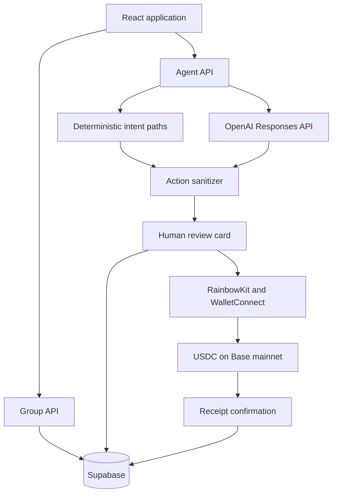

# Splitmate architecture

## System goal

Turn informal group-expense conversation into a verified settlement while keeping every shared-data change and wallet transaction under human control.

## Component map

## Reasoning and action boundary

The Agent receives the latest instruction, the selected group identity, the saved group, calculated balances, and recent conversation history. Common expense and settlement intents use fast deterministic paths. Open-ended requests fall through to the OpenAI Responses API.

Both paths produce the same `AgentAction` union and pass through server-side sanitization. Unknown members, invalid expense indexes, non-positive amounts, oversized values, empty splits, malformed wallets, and unsupported action types are rejected.

## Human confirmation boundary

The model response cannot directly mutate a group. The client renders structured review cards for:

- adding one or more expenses
- editing an expense
- deleting an expense
- adding a member

The group changes only after the user selects **Confirm change**.

## Settlement boundary

`calculateSettlementRows` converts group balances into a short debtor-to-creditor plan. Before payment:

1. Every person involved must have a valid EVM wallet.
2. The connected network must be Base mainnet.
3. The connected address must match the saved payer wallet.
4. The recipient and amount come from the reviewed settlement row.
5. The payer approves the native USDC transfer in their own wallet.
6. Splitmate marks the transfer confirmed only after a successful receipt.

## Persistence and ownership

Groups are cached locally for immediate UX and synchronized to Supabase. Each group is bound to a generated browser client identifier. Server endpoints reload owned group state rather than trusting a client-supplied non-demo group. Conversation messages use an ordered sequence so memory restores chronologically.

## Safety decisions

| Risk | Control |
| --- | --- |
| Model invents an unsupported action | Closed `AgentAction` union and server sanitizer |
| Ambiguous expense | Ask only for the next missing required fact |
| Wrong explicit split | Include payer and only the named participants |
| Silent shared-data mutation | Confirmation card before persistence |
| Invalid amount | Positive finite amount limit plus deterministic-path revalidation |
| Wrong payer | Exact saved-address match |
| Fake payment success | Receipt status controls settlement accounting |
| API cost abuse | Distributed rate limit at the model-call boundary |
| Secret exposure | OpenAI and Supabase service-role keys remain server-side |

